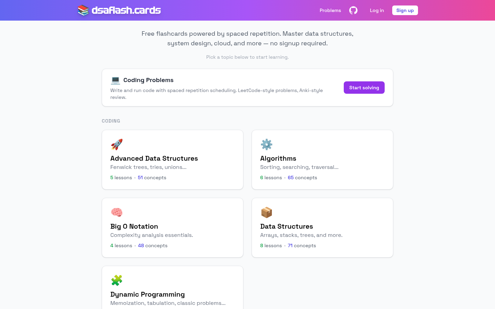

# DSA Flash

A spaced repetition learning platform for data structures and algorithms.

**Live site:** https://dsaflash.cards



## Features

- Learn concepts through bite-sized lessons before you're tested.
- Check understanding with quizzes that unlock flashcards.
- Review cards on an SM-2 spaced repetition schedule.
- Run real code against test cases in an in-browser editor.
- Track progress per category and per problem.

## Quick Start

Requires Docker and Docker Compose.

```bash
git clone --recurse-submodules git@github.com:OpenSauce/dsa-flash.git
cd dsa-flash
make dev
```

Open http://localhost:3000.

The `--recurse-submodules` flag is required — flashcard content lives in the `dsa-flash-cards/` submodule and the app won't load without it.

## Commands

```bash
make dev     # start dev-profile services (frontend-dev, backend-dev, db, pgadmin, plus Judge0 services)
make prod    # start production services
make down    # stop all services
make logs    # tail logs

cd backend && pytest tests/    # backend tests (uses TestContainers, requires Docker)
cd frontend && yarn test       # frontend tests
```

## Project layout

```
frontend/           Nuxt 3 app (Vue 3 + TypeScript + Tailwind)
backend/            FastAPI app (SQLModel + PostgreSQL)
dsa-flash-cards/    Flashcard content (git submodule, YAML)
docker-compose.yml  Dev and prod profiles
Makefile            Common commands
DESIGN.md           Visual design system
```

## Tech stack

Nuxt 3 · FastAPI · PostgreSQL · Docker · Judge0 for code execution
